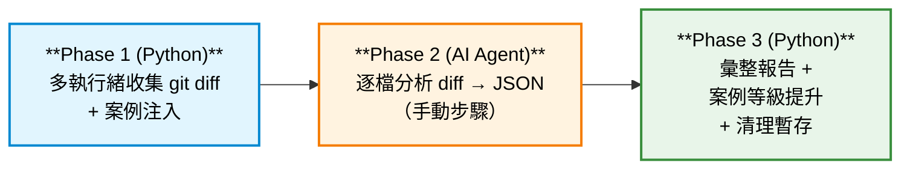

# SKILLS — AI Agent 技能庫

集中管理可由 AI Agent（如 Gemini CLI）調用的自動化技能（Skills），目前收錄 **Code Review Skill**。

---

## 專案結構

```
SKILLS/
├── README.md
├── .gitignore
├── cert/                              # 憑證目錄
│   └── vertexai-private-key.json      # Google Vertex AI Service Account Key（需自行提供）
├── policies/                          # Gemini CLI Policy 設定
│   └── code-review-ruls.toml          # Code Review 非互動模式的工具白名單與權限規則
└── skills/                            # 技能集合
    └── code-review-skill/             # Code Review 技能（詳見下方說明）
        ├── SKILL.md                   # AI Agent 讀取的技能使用指引
        ├── cases/                     # 歷史問題案例庫（*.json）
        │   └── CASE-001.json
        └── scripts/                   # Python 腳本
            ├── code_review.py         # 主程式入口
            ├── agent_worker.py        # diff 取得與儲存模組
            ├── case_matcher.py        # 案例注入與等級提升模組
            └── report_generator.py    # Markdown 報告生成模組
```

---

## Code Review Skill

### 概述

自動偵測基礎分支（`main` / `master`），使用**多執行緒**收集當前分支與基礎分支之間的程式碼差異（diff），交由 **AI Agent 進行逐檔分析**，最終彙整產出結構化的 Markdown Code Review 報告。

### 核心特色

| 特色           | 說明                                                           |
| -------------- | -------------------------------------------------------------- |
| 🧵 多執行緒收集 | 最多 10 個執行緒並行取得 git diff，Work Queue 模式動態分派     |
| 🤖 AI 代理分析  | Agent 讀取 diff 檔案後輸出結構化 JSON 結果                     |
| 📚 歷史案例庫   | 自動比對歷史問題關鍵字，注入提示至 diff 供 AI 參考             |
| ⬆️ 等級自動提升 | 命中歷史案例的問題，嚴重等級自動升級                           |
| 📊 結構化報告   | 依分類 × 嚴重程度輸出 Markdown 報告，含建議程式碼片段          |
| 🔍 副檔名過濾   | 僅掃描程式碼相關檔案（`.java`, `.py`, `.js`, `.ts` 等 20+ 種） |

### 執行流程



#### Phase 1：收集 diff

```bash
python scripts/code_review.py --repo /path/to/project
```

- 自動偵測基礎分支（可用 `--base-branch` 覆蓋）
- 多執行緒並行產生 diff，結果儲存至 `code-review/references/diff/<filename>_diff.diff`
- 若歷史案例庫存在，自動在 diff 頂部注入 `AUTO-INJECTED CONTEXT` 提示

#### Phase 2：AI 代理分析（非腳本自動化）

> ⚠️ **此步驟由 AI Agent 手動執行，不需要執行任何 Python 腳本。**

AI Agent 讀取每個 `_diff.diff` 檔案進行全面缺陷掃描，將分析結果寫入對應的 `_result.json`。

#### Phase 3：產出報告

```bash
python scripts/code_review.py --report --repo /path/to/project
```

- 讀取所有 `*_result.json` 分析結果
- 命中歷史案例的問題自動提升嚴重等級
- 輸出 Markdown 報告至 `code-review/references/report/<project>_report.md`
- 報告產出後自動清理暫存 diff 檔案

### 輸出路徑

| 類型             | 路徑                                                     |
| ---------------- | -------------------------------------------------------- |
| 個別檔案 diff    | `code-review/references/diff/<filename>_diff.diff`       |
| 個別檔案分析結果 | `code-review/references/analysis/<filename>_result.json` |
| 彙整報告         | `code-review/references/report/<project>_report.md`      |

### 分析結果 JSON 格式

```json
{
  "f": "src/相對路徑/檔案.py",
  "i": [
    {
      "cat": "sec",
      "sev": "high",
      "ln": 42,
      "desc": "問題描述",
      "sugg": "修改建議（必填）",
      "code": "建議程式碼片段（必填）",
      "matched_case_ids": ["CASE-001"]
    }
  ]
}
```

<details>
<summary>欄位說明</summary>

| 欄位               | 說明       | 允許值                                            |
| ------------------ | ---------- | ------------------------------------------------- |
| `f`                | 檔案路徑   | 相對路徑字串                                      |
| `i`                | 問題清單   | 陣列，無問題時為 `[]`                             |
| `cat`              | 問題分類   | `bl`（業務邏輯）/ `sec`（安全性）/ `perf`（效能） |
| `sev`              | 嚴重程度   | `critical` / `high` / `medium` / `low` / `info`   |
| `ln`               | 行號       | 整數或 `null`                                     |
| `desc`             | 問題描述   | 精簡字串                                          |
| `sugg`             | 修改建議   | **必填**，具體可操作的修復方式                    |
| `code`             | 建議程式碼 | **必填**，修復後的程式碼片段                      |
| `matched_case_ids` | 命中案例   | 選填，字串陣列                                    |

</details>

### 嚴重等級定義

| 等級         | 說明                   |
| ------------ | ---------------------- |
| 🔴 `critical` | 嚴重漏洞、資料遺失風險 |
| 🟠 `high`     | 高風險，應在合併前修復 |
| 🟡 `medium`   | 中等風險，建議修復     |
| 🔵 `low`      | 低風險，可考慮改善     |
| ⚪ `info`     | 最佳實踐建議           |

### CLI 參數一覽

| 參數            | 預設值                            | 說明                  |
| --------------- | --------------------------------- | --------------------- |
| `--repo`        | `.`                               | Git 專案根目錄        |
| `--workers`     | `10`                              | 最大執行緒數          |
| `--base-branch` | 自動偵測                          | 指定基礎分支          |
| `--diff-dir`    | `code-review/references/diff`     | diff 儲存目錄         |
| `--result-dir`  | `code-review/references/analysis` | JSON 結果存放目錄     |
| `--report-dir`  | `code-review/references/report`   | 報告輸出目錄          |
| `--cases-dir`   | `skills/code-review-skill/cases`  | 歷史案例庫目錄        |
| `--report`      | `false`                           | 啟用 Phase 3 報告模式 |

### 歷史案例庫

案例以 JSON 檔案儲存於 `cases/` 目錄，包含以下欄位：

```json
{
  "id": "CASE-001",
  "title": "檔案複製大小驗證邏輯缺陷",
  "description": "問題完整描述...",
  "keywords": ["FileUtils.copy", "file size", "continue", ...],
  "category": "bl",
  "escalate_to": "high"
}
```

- **Phase 1 注入**：腳本掃描 diff 內容是否包含案例關鍵字，若命中則自動將提示注入到 diff 檔案頂部
- **Phase 3 提升**：AI 分析結果中若標記了 `matched_case_ids`，報告產出時自動將該問題的嚴重等級提升至案例指定的 `escalate_to` 等級

### 模組說明

| 模組                  | 職責                                                           |
| --------------------- | -------------------------------------------------------------- |
| `code_review.py`      | 主程式入口，串接 Phase 1 / Phase 3 流程、CLI 參數解析          |
| `agent_worker.py`     | 分支偵測、單一檔案 diff 取得與儲存、結構化 prompt 組裝         |
| `case_matcher.py`     | Phase 1 案例關鍵字注入 + Phase 3 命中等級提升                  |
| `report_generator.py` | 彙整 JSON 分析結果，輸出含摘要表格與程式碼片段的 Markdown 報告 |

---

## Policy 設定

`policies/code-review-ruls.toml` 為 Gemini CLI 的 Policy 規則檔，設定非互動模式（`interactive = false`）下允許使用的工具清單：

- `activate_skill`、`run_shell_command`、`list_directory`、`read_file`、`write_file`、`write_todos`、`get_internal_docs`

> 參考：[Gemini CLI Policy Engine 文件](https://geminicli.com/docs/reference/policy-engine/)

---

## 環境需求

- **Python** 3.10+
- **Git**（已安裝並加入 PATH）
- 無需額外 `pip install`，所有模組僅使用 Python 標準庫

---

## 授權

此專案為內部工具，請依組織規範使用。
---

# 台灣股市與期貨報價腳本 (Taiwan Stock & Futures API Script)

## 1. 專案簡介
本專案旨在解決 Yahoo Finance 等常見免費財經 API 在台灣股市、期貨與選擇權報價上不準確及資料缺失的問題。透過此腳本，可精準獲取台灣股期權市場行情與總體經濟資料，為後續的量化分析與自動化交易（如「投資蝦」專案）提供穩定且可靠的數據基礎。

## 2. 環境安裝
請確保系統已安裝 Python 3.8 或以上版本。接著請在專案根目錄下使用以下指令安裝所需的依賴套件：

```bash
pip install -r requirements.txt
```

## 3. 使用方法
執行主程式 `main.py` 來抓取指定日期的市場資料。為了確保資料的準確性與可回溯性，**請務必使用 `--date` 參數**來指定抓取日期。

指令範例：
```bash
python main.py --date 20260506
```
*   `--date` 參數格式為 `YYYYMMDD`（例如：20260506 代表 2026 年 5 月 6 日）。
*   若未提供參數，系統將根據預設邏輯抓取最新一個交易日的資料。

## 4. 輸出格式 (JSON Schema)
腳本執行完畢後，預設會輸出或回傳結構化的 JSON 資料，讓「投資蝦」可以直接解析使用。以下為輸出的精簡版 JSON Schema 結構說明：

```json
{
  "$schema": "http://json-schema.org/draft-07/schema#",
  "type": "object",
  "properties": {
    "date": {
      "type": "string",
      "description": "資料日期，格式為 YYYY-MM-DD"
    },
    "market_summary": {
      "type": "object",
      "description": "大盤及期貨總結資訊",
      "properties": {
        "twse_index": { "type": "number", "description": "台灣加權指數收盤價" },
        "tx00": { "type": "number", "description": "台指期近月合約報價" },
        "total_volume": { "type": "number", "description": "大盤總成交金額" }
      }
    },
    "stocks": {
      "type": "array",
      "description": "個股報價列表",
      "items": {
        "type": "object",
        "properties": {
          "symbol": { "type": "string", "description": "股票代號" },
          "close": { "type": "number", "description": "收盤價" },
          "volume": { "type": "number", "description": "成交量" }
        }
      }
    },
    "macro_data": {
      "type": "object",
      "description": "總體經濟數據 (如台幣匯率等)",
      "properties": {
        "usd_twd": { "type": "number", "description": "美元兌台幣匯率" }
      }
    }
  },
  "required": ["date", "market_summary", "stocks"]
}
```
