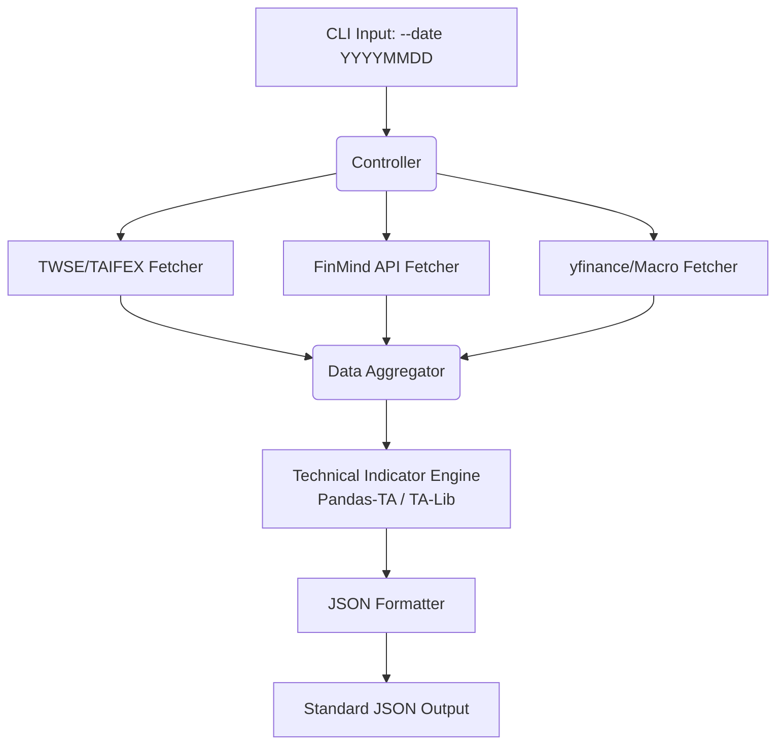

# 投資蝦專案 - Taiwan Market Data API 系統架構與需求規格書

## 1. 系統架構與資料流 (Data Flow)

系統採 CLI 架構設計，接收指定日期參數後，併發向多個資料源請求原始數據，經由內部引擎進行清理、指標運算，最終匯總成單一 JSON 結構輸出。



## 2. 模組與推薦資料來源對應表

為解決過去 Yahoo Finance 報價與籌碼不準確的問題，針對台股現貨與期貨，全面改用證交所/期交所官方公開資料或 FinMind API 作為主資料源；美股與總經則維持使用穩定的大型第三方 API。

| 模組 | 數據項目 | 推薦資料來源 (Data Source) | 備註 / 取代方案 |
|---|---|---|---|
| **1. 期權籌碼** | 三大法人期貨未平倉 | **FinMind API** (`TaiwanFuturesInstitutionalInvestors`) 或 期交所每日結算表 | 優先使用 FinMind 降低爬蟲維護成本 |
| | 十大特定法人未平倉 | **期交所 Open Data** (大額交易人未平倉部位) | 需解析期交所 CSV/HTML |
| | P/C Ratio | **期交所 Open Data** (臺臺指選擇權買賣權分計) | Put 成交量/未平倉量 除以 Call |
| | 散戶小台指多空比 | **自行計算** (小台未平倉總量 - 三大法人小台未平倉) | 需同時取得總未平倉與法人未平倉 |
| **2. 現貨大盤** | 三大法人買賣超金額 | **TWSE OpenAPI** / FinMind | 證交所 API 穩定度高 |
| | 信用交易(融資券餘額) | **TWSE OpenAPI** (信用交易統計) | 需注意上市與上櫃(OTC)資料需合併 |
| | 大盤 OHLC 與成交值 | **TWSE OpenAPI** (發行量加權股價指數) | 開高低收與單日成交值 |
| **3. 總經跨市場** | 台積電 ADR (TSM) 溢價率 | **yfinance** (`TSM` 與 `2330.TW`) | 溢價率 = (TSM/5 * 匯率) / 2330收盤價 - 1 |
| | USD/TWD 匯率 | **yfinance** (`TWD=X`) 或 台灣央行 Open Data | yfinance 即時性較佳 |
| | 恐慌指數 (VIX) | **yfinance** (`^VIX`) | 芝加哥選擇權交易所 VIX |
| | 美債 10 年期殖利率 | **yfinance** (`^TNX`) | |
| | 台指期夜盤準確收盤價 | **期交所 Open Data** (盤後交易行情表) | 需抓取次一營業日的盤後結算價 |
| **4. 技術指標** | MA, BIAS, KD, RSI, MACD | **本地計算 (Pandas-TA)** | 需快取過去 60 天以上的大盤歷史價格來計算 |

## 3. 預期 JSON 輸出格式 (Schema 範例)

```json
{
  "query_date": "2026-05-06",
  "status": "success",
  "data": {
    "chips": {
      "foreign_futures_oi": 12500,
      "top10_specific_oi": 8400,
      "pc_ratio": 1.15,
      "retail_mtx_long_short_ratio": -15.2
    },
    "spot": {
      "institutional_net_buy": 15000000000,
      "margin_balance": 280000000000,
      "short_balance": 320000,
      "ohlc": {
        "open": 21000.5,
        "high": 21150.0,
        "low": 20980.5,
        "close": 21120.3
      },
      "total_volume": 450000000000
    },
    "macro": {
      "tsm_adr_premium_percent": 12.5,
      "usd_twd_rate": 32.45,
      "vix": 14.2,
      "us_10y_yield": 4.52,
      "night_session_close": 21150
    },
    "technical": {
      "ma": {
        "ma5": 21050.2,
        "ma10": 20900.5,
        "ma20": 20650.0,
        "ma60": 20100.8
      },
      "bias": {
        "bias_20": 2.27 
      },
      "indicators": {
        "kd": { "k": 85.2, "d": 80.1 },
        "rsi_14": 68.5,
        "macd": { "dif": 120.5, "dea": 105.2, "histogram": 15.3, "divergence_warning": false }
      }
    }
  },
  "errors": []
}
```

## 4. 潛在風險與技術瓶頸

1. **技術指標的歷史資料依賴 (Cold Start Problem)**：
   - **問題**：計算 MA60, RSI, MACD 需要至少過去 60~100 天的歷史資料。若只請求單日 (`--date`)，無法直接計算。
   - **解法**：建議 PG 開發時，需具備本地 SQLite 快取機制。當請求指定日期時，系統自動拉取該日往推 100 天的歷史現貨 K 線進行運算，算完後再截取指定日期的指標結果輸出。
2. **夜盤資料取得的時間差**：
   - **問題**：期交所的「盤後交易(夜盤)」資料，通常在隔日清晨 05:00 才會收盤並產出報表。若在當日半夜查詢，可能拿不到完整的夜盤收盤價。
   - **解法**：架構上需針對未產出的資料設計 Fallback 機制，或在 JSON 的 `errors` 陣列中提示 `"night_session_data_unavailable"`，避免因單一資料缺漏導致整支腳本 Crash。
3. **API 頻率限制 (Rate Limits)**：
   - **問題**：FinMind API 免費版有每小時 600 次請求限制；TWSE OpenAPI 也有連線頻率防護。若回測時大量呼叫 `--date`，容易被 Ban IP。
   - **解法**：呼叫層需實作 Retry-After 與 Delay (例如每打一次 API 暫停 1-3 秒)；或者在回測模式下，改為一次拉取 Date Range 的批次資料，而非迴圈逐日呼叫。
4. **散戶小台多空比的精準度**：
   - **問題**：官方無直接數據，需依賴公式 `(小台指全市場未平倉 - 三大法人小台指未平倉) / 小台指全市場未平倉` 計算。
   - **解法**：需確保兩邊資料來源的「更新時間」一致，否則在每日 15:00 ~ 17:00 期間資料尚未完全公佈時計算，會產生嚴重誤差。